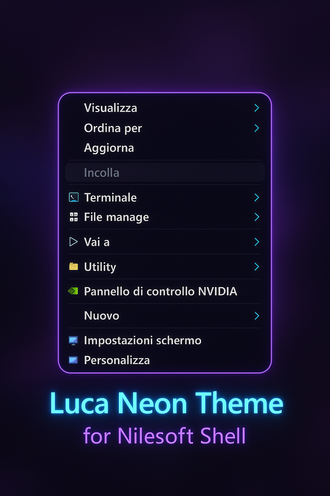

<h1 align="center">🎯 Luca Neon Theme for Nilesoft Shell</h1>

  

  
  
  

---

## 🧩 Descrizione
**Luca Neon Theme** è un tema elegante e cyberpunk per **Nilesoft Shell**, ispirato allo stile *Dracula*.  
Combina toni scuri con accenti neon per un look moderno, compatto e perfettamente leggibile.  
Progettato per chi ama un’interfaccia minimal ma d’impatto.

---

## ✨ Caratteristiche
- Palette neon viola e ciano con contrasto bilanciato  
- Bordi sottili e ombre morbide per effetto vetro-futuristico  
- Font *Segoe UI Variable Text* ottimizzato per leggibilità  
- Layout compatto e coerente con lo stile dark moderno  
- Estetica raffinata e professionale

---

## ⚙️ Installazione

1. Scarica il file del tema:

2. Rinominalo in: theme.nss

3. Copialo nella cartella **imports** di Nilesoft Shell: C:\Users<tuo_nome>\AppData\Local\Nilesoft\Shell\Imports

4. Riavvia Nilesoft Shell oppure esegui: shell reload

5. Il tema verrà applicato automaticamente.  
Se non appare subito, apri il menu con **clic destro sul desktop**.

---

## 📸 Anteprima

---

## 👤 Autore
**Luca Drogo**  
🔗 [GitHub Profile](https://github.com/tuo-username)

---

### 📄 Licenza
Rilasciato gratuitamente per uso personale.  
È consentita la modifica e la ridistribuzione, citando l’autore originale.

---

